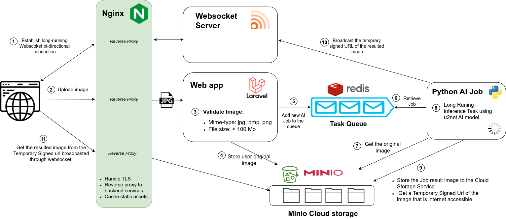

<h1> &nbsp; Detourer</h1>


You can visit the live project [here](https://detourer.io).

## System Design




Since the AI jobs processing the images to remove their background are long running tasks (5 to 10 seconds), we have to run them **asynchronously**. To achieve that I used a Redis instance that will be used as a queue to store the AI Jobs submitted by the Laravel Web App. The Web App will return return a `200` http code when a user upload an image and a Job will be queued. A `mysql` db is also used to track the jobs (failed jobs, job status).
Once the Job is sumbitted, a Worker service is listening to the queue and start processing it **asynchronously**. Once the AI job is done, the `Worker` service broadcasts an Event with the image url and the event is notified to the user thanks to the `Websocket` server.   

I also wanted to build an app that can easily scale, especially an app that can **scale horizontally**. To achieve that I decoupled the storage layer from the Web app and from the Worker service. I used a separate Minio Cloud Storage service for that. Thanks to that the Worker Service and the Web app are **stateless** and can be replicated as needed and can the instances can live in separate servers.
 
In the production server there are 4 `Workers services` and the AI tasks are distributed equally in a round robbin manner among the different workers.


## Dev locally

1. Start the services used by the app: (mysql, redis, minio, reverb) 

```bash
docker compose -f dev.docker-compose.yaml up -d 
```

2. Run the migrations
   
```bash
php artisan migrate
```

This command will spin up a Websocket Reverb Server, a Redis for the queued Jobs a Minio server for storing the images and a Mysql server. 

3. Run the php server in a terminal
```bash
php artisan serve
```

4. In another terminal run the Vite server for hot reloading of Front assets (usefull for frontend dev)

```bash
npm run dev
```

5. Run a php queue worker to process Jobs
   
```bash
php artisan queue:work
```

6. Browse `https://localhost:8000`

All the configuration variables used in the app are in the file `.env` at the root of the project. 

## Deploy locally

```bash
sudo ./install_or_update.sh
```
1. Choose `local` when environment is prompted.
2. Choose a `domain name` it will automatically add appropirate lines in `/etc/hosts` in order to route the requests to `your domain name` to `localhost`.
3. Choose the `number of workers` that process the Background Removal tasks.  
4. You can choose either or not to build the `worker` image. It does not depend on `domain name` and it takes a long time to build (it needs to download AI models) so you can skip the build if you did not change the `worker` code after the last `worker` build. 
5. Browse `http://yourdomain.com`. 

## Deploy in a live server for production

1. Buy a VPS server with sufficiant RAM and CPU (at least 4GO RAM and 2 cores CPU) 
2. Buy a domain name `yourdomain` 
3. Manage DNS records of `yourdomain` to point to your VPS ip address :
   - `yourdomain` -> ip address
   - reverb.`yourdomain` -> ip address
   - minio.`yourdomain` -> ip address
   - adminio.`yourdomain` -> ip address

```bash 
sudo ./install_or_update.sh
```

4. Choose `production` when environment is prompted.
5. You can choose either or not to build the `worker` image. It does not depend on `domain name` and it takes a long time to build (it needs to download AI models) so you can skip the build if you did not change the `worker` code after the last `worker` build. 
6. Browse `https://yourdomain.com`. 

## CI/CD Pipeline

A **CI/CD** pipeline has been created thanks tot Github Actions. On new `github release` the 3 images: `rembg`, `webserver` and `worker` are build and pusehd to my Docker Hub registery. Then It connects to my **VPS** through `ssh` pull the new docker images and tells `docker compose` to recreate the containers with the new images. The CI/CD yaml file is located at `.github/workflows/deploy.yaml`.

### Fire the CI/CD pipeline

```bash
gh release create <tag_name> --title "<release_title>" --notes "<release_notes>"
```
**Example:** 

```bash
gh release create v1.0.0 --title "First Release" --notes "a Handy app to automtically detect and remove background from images"
```
### Test the CI/CD pipeline locally

- Use `act` command. It will use the secret file: `.secrets` to fill the secrets in the `deploy.yaml` manifest.

```bash
act
```
- Test a specific Job

```bash
act -j build
```

## TODO

- SEO optimization with some Laravel Package maybe ? 
- Disable Session cookie for unauthenticated users (the app does not track user) so they are useless. Then it will allow to **cache** the home page at nginx level or Cache it using a CDN. It will improve home page response time which is good for SEO. 
- Video support
- Create Kubernetes manifests and a Helm package to allow autoscaling horizontally in a cluster of nodes or maybe use Swarm ? 


