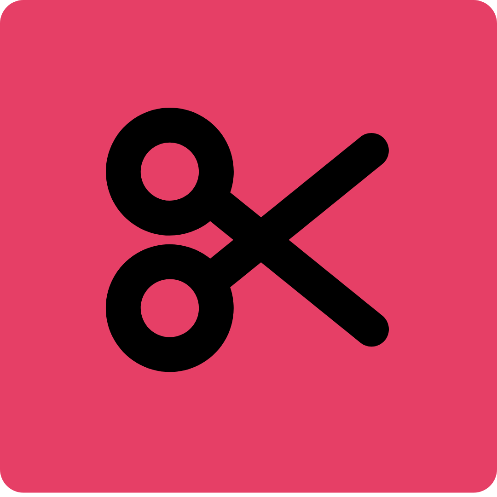

<svg fill="none" viewBox="0 0 600 300" width="600" height="300" xmlns="http://www.w3.org/2000/svg">
  <foreignObject width="100%" height="100%">
      <div xmlns="http://www.w3.org/1999/xhtml">
         <style>
         .divstyle {
            display: flex;
            align-items: center;
         }
         </style>
         <div style="divstyle">
            
            <h1 style="margin-top: 20px;">Detourer</h1>
         </div>
      </div>
  </foreignObject>
</svg>


You can visit the live project [here](https://detourer.io).

## Architecture

## Dev locally

1. Start the services used by the app: (mysql, redis, minio, reverb) 

```bash
docker compose -f dev.docker-compose.yaml up -d 
```

2. Run the migrations
   
```bash
php artisan migrate
```

This command will spin up a Websocket Reverb Server, a Redis for the queued Jobs a Minio server for storing the images and a Mysql server. 

3. Run the php server in a terminal
```bash
php artisan serve
```

4. In another terminal run the Vite server for hot reloading of Front assets (usefull for frontend dev)

```bash
npm run dev
```

5. Run a php queue worker to process Jobs
   
```bash
php artisan queue:work
```

6. Browse `http://localhost:8000`

All the configuration variables used in the app are in the file `.env` at the root of the project. 

## Deploy locally

```bash
sudo ./install_or_update.sh
```
1. Choose `local` when environment is prompted.
2. Choose a `domain name` it will automatically add appropirate lines in `/etc/hosts` in order to route the requests to `your domain name` to `localhost`.
3. Choose the `number of workers` that process the Background Removal tasks.  
4. You can choose either or not to build the `worker` image. It does not depend on `domain name` and it takes a long time to build (it needs to download AI models) so you can skip the build if you did not change the `worker` code after the last `worker` build. 
5. Browse `http://yourdomain.com`. 

## Deploy in a live server for production

1. Buy a VPS server with sufficiant RAM and CPU (at least 4GO RAM and 2 cores CPU) 
2. Buy a domain name `yourdomain` 
3. Manage DNS records of `yourdomain` to point to your VPS ip address :
   - `yourdomain` -> ip address
   - reverb.`yourdomain` -> ip address
   - minio.`yourdomain` -> ip address
   - adminio.`yourdomain` -> ip address

```bash 
sudo ./install_or_update.sh
```

4. Choose `production` when environment is prompted.
5. You can choose either or not to build the `worker` image. It does not depend on `domain name` and it takes a long time to build (it needs to download AI models) so you can skip the build if you did not change the `worker` code after the last `worker` build. 
6. Browse `http://yourdomain.com`. 
   
## TODO

- SEO optimization with some Laravel Package maybe ? 
- Disable Session cookie for unauthenticated users (the app does not track user) so they are useless. Then it will allow to **cache** the home page at nginx level or Cache it using a CDN. It will improve home page response time which is good for SEO. 
- Architecture Schema. 
- Video support
- build a CI/CD pipeline for delivering new features faster
- Create Kubernetes manifests and a Helm package to allow autoscaling horizontally in a cluster of nodes or maybe use Swarm ? 


